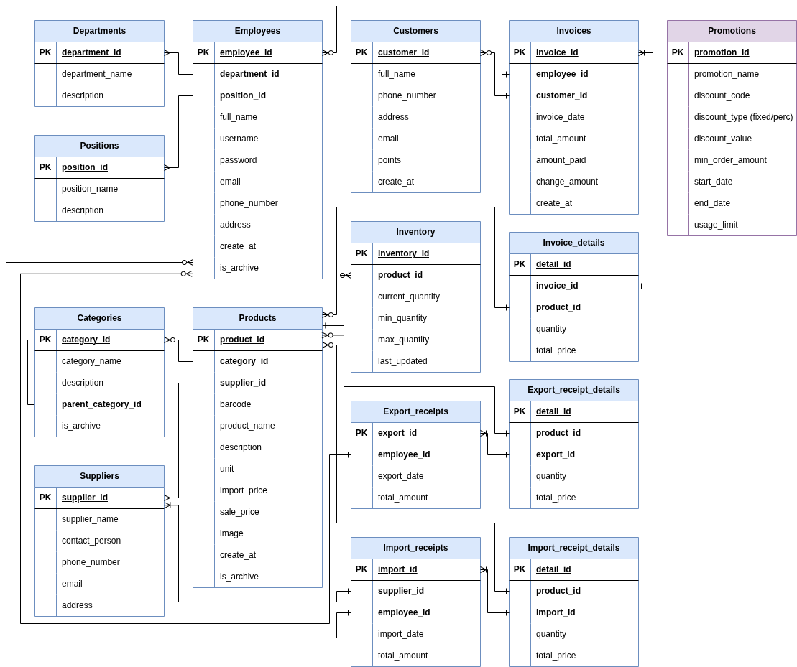

# C# Mini Market Database Design
We use sqlite because it is lightweight and simple to deploy. small desktop software shouldn't have a whole database server ecosystem.

## ERD


## SQL demo screenshot


I use docker to build everything. Because I don't want to break anything. So there is how I create this database:

```bash
# We will do everything in this container
[host]$ docker run -it ubuntu /bin/bash
# Then inside the container
[container]$ sqlite3 database.sqlite3 < script.sql # sqlite must be installed
```
#Drawio Class Diagram
https://drive.google.com/file/d/1_vRQ3hf37h94D0RT1SALaH8awx77AmaY/view?usp=sharing

