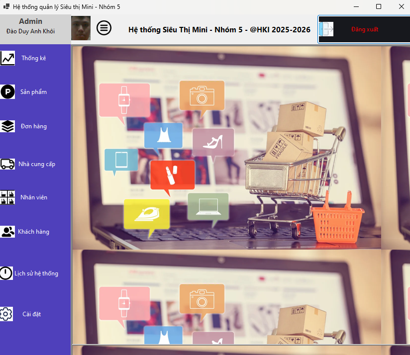
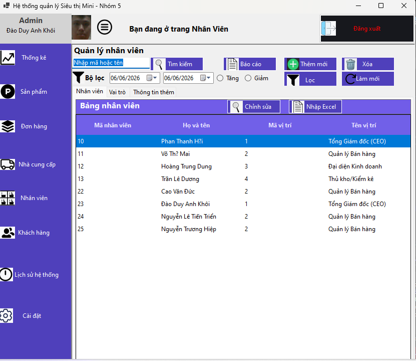
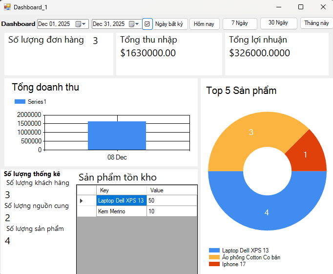
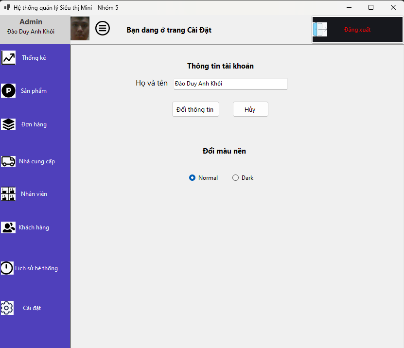
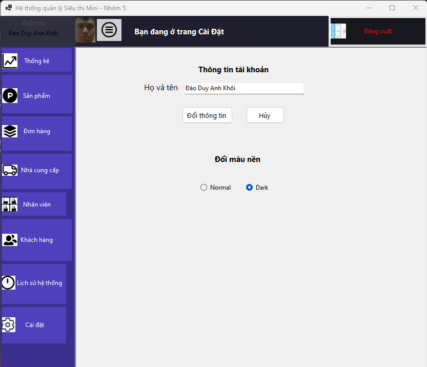
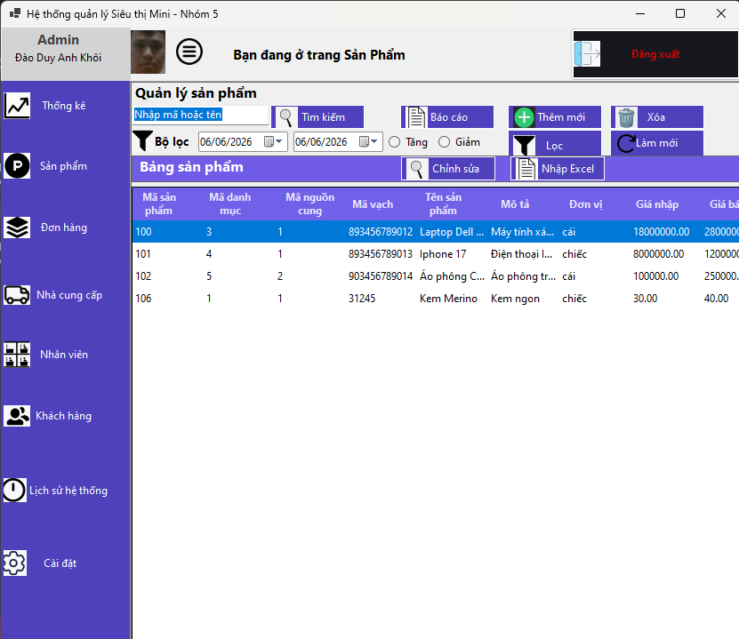
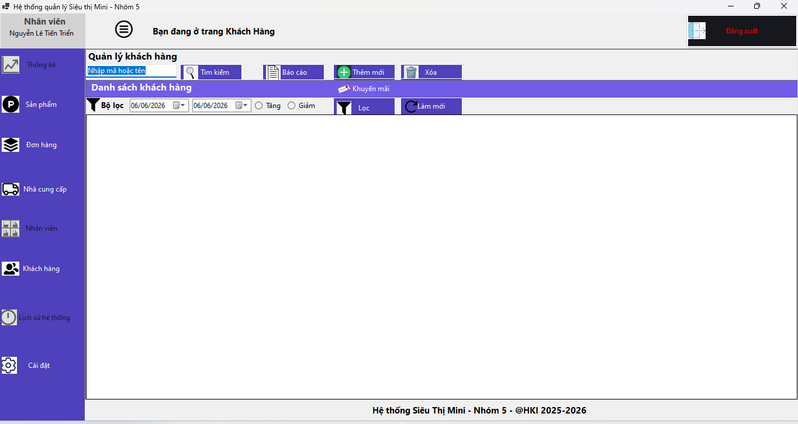
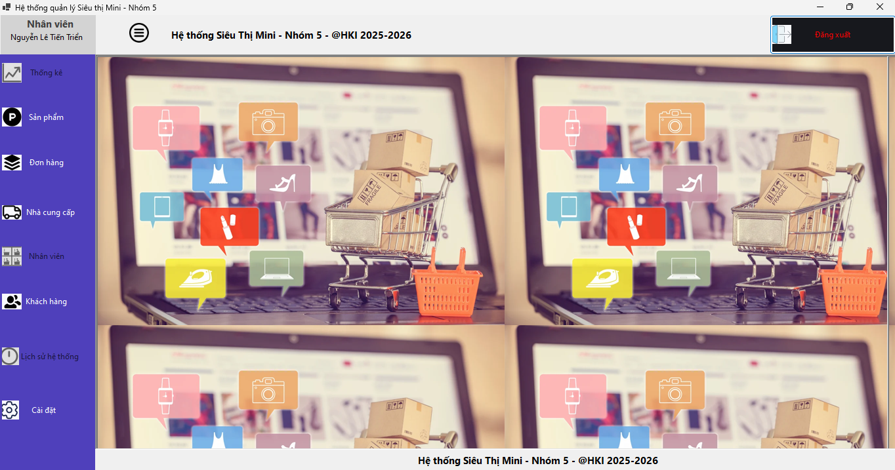
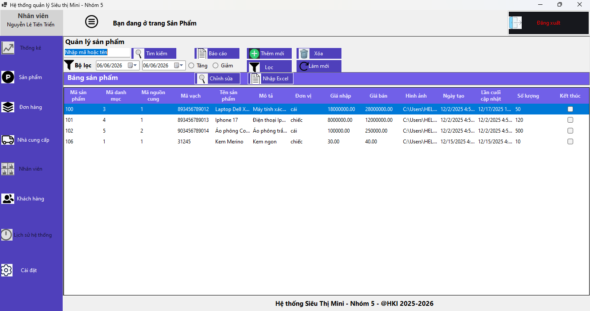

# Mini Market Management Desktop Application

A role-based desktop application for managing a mini market.  
This project was developed as an academic assignment to practice **Fullstack Development** with **C#**, **WinForms**, and **Microsoft SQL Server**.

---

## 📌 Project Information
- **Team size:** 2  
- **Role:** Fullstack Developer  
- **Duration:** Sept 2025 – Present  
- **Languages/Frameworks:** C#, WinForms, .NET 9.0 & .NET Framework 4.8  

---

## 📌 Overview
The system is designed to manage market operations including product inventory, orders, suppliers, and customers.  
It implements a **Three-layer Architecture** and supports role-based access control.

---

## 📌 Features
- <mark>Authentication</mark> (login/register)  
- <mark>Role-based Access Control</mark> (Admin, Employee)  
- <mark>Product/Order Management</mark>  
- <mark>Supplier/Customer Modules</mark>  
- <mark>Statistics</mark> and <mark>System History</mark>  
- <mark>Password Recovery via Email</mark>  
- <mark>Dark/Light Mode Toggle</mark>  

---

## 📌 System Design
- Designed <mark>ERD</mark> for database schema  
- Implemented <mark>Three-layer Architecture</mark> for maintainability  
- Database schema in <mark>Microsoft SQL Server</mark>  

---

## 📌 How to Run
1. Clone the repository:
   ```bash
   git clone https://github.com/DuyKhoiCoder30062004/C--Mini-Market.git
2. Open the project in Visual Studio.
3. Configure the SQL Server connection string.
4. Build and run the solution.

## 📌 Screenshots
## Quyền Admin
<div align="center">


  

   

</div>

## Quyền Nhân Viên
<div align="center">


   
</div>


## 📌 Contribution
Developed by a team of 2 students as part of academic coursework.

## 📌 License
This project is for educational purposes only.
