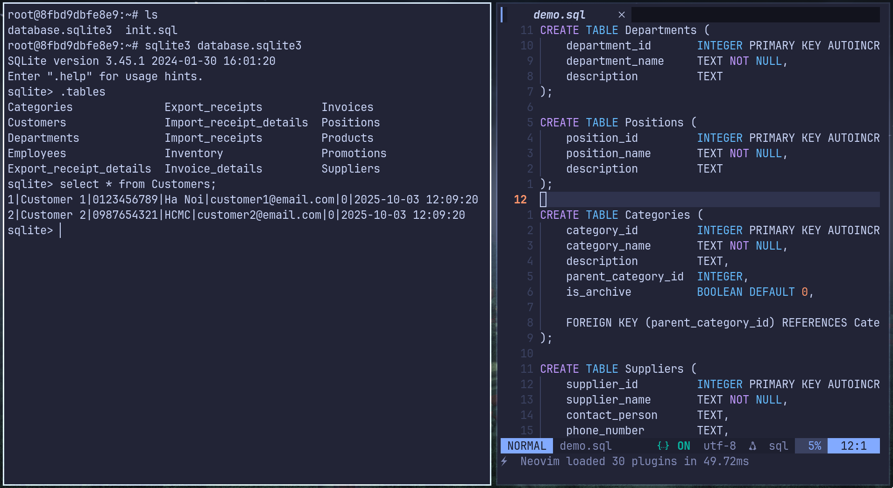

# C# Mini Market Database Design
We use sqlite because it is lightweight and simple to deploy. small desktop software shouldn't have a whole database server ecosystem.

## ERD (Xài SQL Server khi DEMO chính yếu cho thầy, nghĩa là team lead DEMO, gộp code hết tất tật rồi connect với SQL Server)
## Của nhánh database-initialization - now
## Bỏ cột department_id 

## SQL demo screenshot


I use docker to build everything. Because I don't want to break anything. So there is how I create this database:

```bash
# We will do everything in this container
[host]$ docker run -it ubuntu /bin/bash
# Then inside the container
[container]$ sqlite3 database.sqlite3 < script.sql # sqlite must be installed


```
# C# Mini Market Figma Design for UI.
